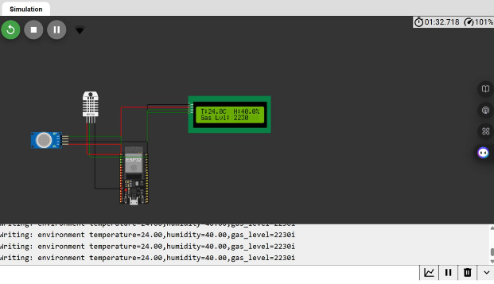
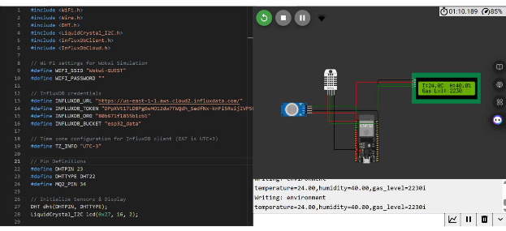
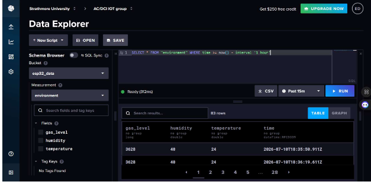
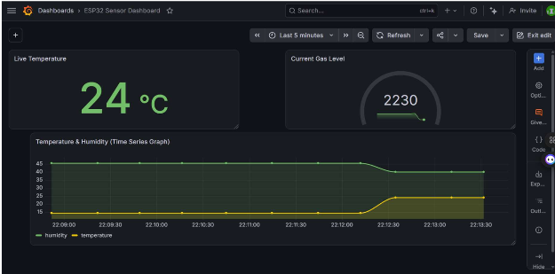

# IoT Deliverable Three

## 1. The Simulation

**Architecture:** 1 ESP32 connected to 1 MQ-2 (Gas Sensor), 1 DHT22 (Temperature & Humidity), and 1 LCD (I2C).

This architecture serves as the edge device for the team's cloud integration. The ESP32 is programmed to sample environmental metrics — temperature, humidity, and gas concentration — every 10 seconds. It displays these variables locally on the LCD screen while simultaneously establishing a Wi-Fi connection to transmit the data payload to the cloud via an HTTP API. The simulation was successfully compiled and executed online using the Wokwi web environment.

**Simulated Model Link:** [wokwi.com/projects/469158779733863425](https://wokwi.com/projects/469158779733863425)

### Simulation Execution

---

## 2. InfluxDB (Cloud Data Storage)

InfluxDB Cloud acts as the time-series database for this project. Once connected to Wi-Fi, the ESP32 utilizes a secure API token, Organization ID, and URL to push data into the designated cloud bucket (`esp32_data`). The telemetry data is structured using Line Protocol and grouped under an "environment" measurement, allowing the database to efficiently timestamp and store the temperature, humidity, and gas level data streams for querying.

### Data Storage Evidence

---

## 3. Grafana (Data Visualization)

Grafana is integrated directly with the InfluxDB cloud instance to provide real-time, industry-standard visual analytics. Using the Flux scripting language to query the database, the team configured a dashboard with three distinct panels to monitor the physical environment:

- **Live Temperature:** a stat panel displaying the most recent temperature reading in Celsius.
- **Current Gas Level:** a gauge panel configured with color-coded health thresholds (green for normal, yellow for warning, red for critical) to monitor the analog MQ-2 readings.
- **Environmental Metrics:** a time-series graph that tracks historical temperature and humidity trends.

**Grafana Dashboard Link:** [boldflax650.grafana.net/goto/s54jlj?orgId=stacks-1719195](https://boldflax650.grafana.net/goto/s54jlj?orgId=stacks-1719195)

### ESP32 Sensor Dashboard

---

## 4. Groupwork Evidence

The following evidence verifies the active participation of all group members during the circuit design, cloud configuration, and dashboard integration phases of this deliverable.

