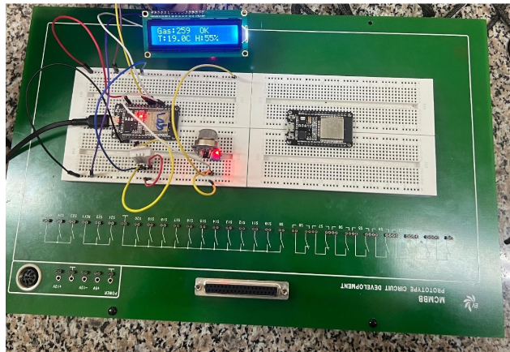
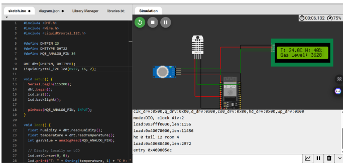
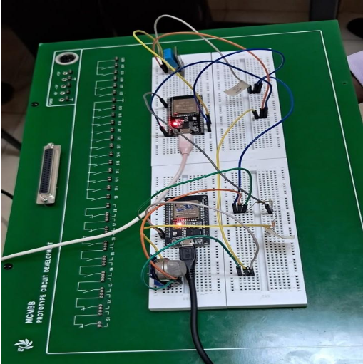
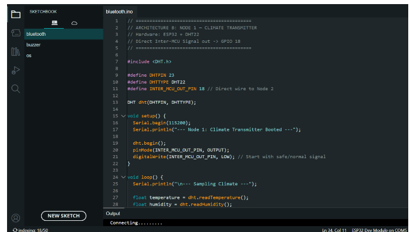
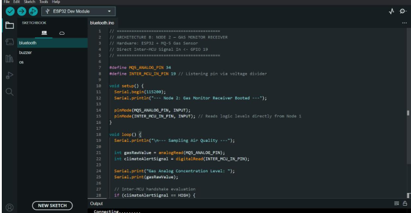
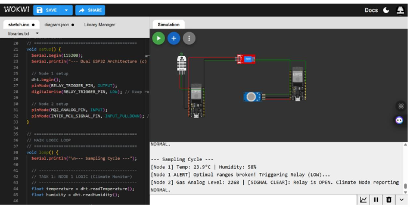
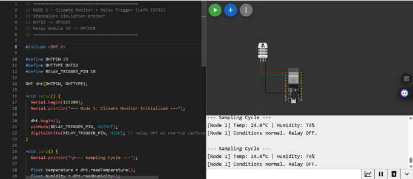
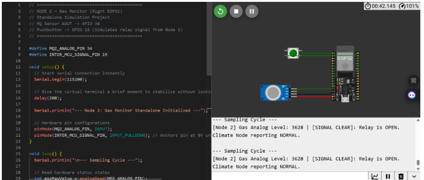
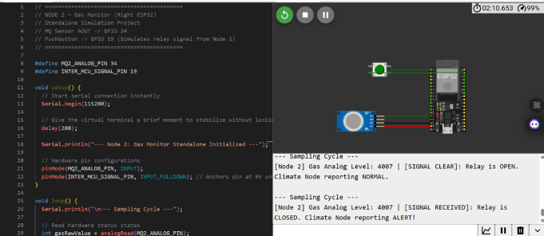

# IoT Deliverable Two

**AC/DCI Group**

| Name | ID |
|---|---|
| Donell Bikketi | 166604 |
| Gloria Kendi | 166074 |
| Emmanuel Douglas | 168053 |
| Crystal Kanana | 169820 |
| Andrew Kigondu | 166228 |

---

## Assignment Brief

Using the schematics from Deliverable 1, the team was tasked with building physical and simulated prototypes for three device architectures (simulations built in Wokwi):

- **(a)** 1 ESP32S connected to 1 MQ-5, 1 DHT22, and 1 LCD — **both** a physical **and** a simulated model required.
- **(b)** 1 ESP32S connected to 1 MQ-5, interfaced directly with another ESP32S connected to 1 DHT22 — **either** a physical **or** a simulated model (interchangeable with architecture c).
- **(c)** 1 ESP32S connected to 1 DHT22, connected to a relay, which connects to another ESP32S connected to 1 MQ-5 — **either** a physical **or** a simulated model (interchangeable with architecture b).

If a physical model is built for (b), a simulated model must be built for (c), and vice versa — the team should end up with **at least 4 prototypes in total**. All prototypes must display suitable output, and physical builds must use resistors to protect components.

---

## 1. Architecture A: Single Controller Setup

**1 ESP32S connected to 1 MQ-5, 1 DHT22, and 1 LCD (both physical and simulated models)**

This architecture combines all environmental monitoring into a single node. The ESP32 reads temperature and humidity from the DHT22 and gas concentration from the MQ-5, displaying the physical environment variables locally on the LCD screen. If parameters fall outside stipulated optimal ranges, it is flagged on the display.

### Physical Implementation

### Simulated Model

🔗 [wokwi.com/projects/468456071711542273](https://wokwi.com/projects/468456071711542273)

---

## 2. Architecture B: Direct Inter-MCU Connection

**1 ESP32S connected to 1 MQ-5, interfaced directly with another ESP32S connected to 1 DHT22**

In this physical build, the two microcontrollers communicate directly via a shared hardware signaling line without the use of a relay. The first node (Climate Monitor) tracks temperature and humidity. If thresholds are broken, it sends a voltage signal directly from its output pin to the input pin of the second node (Gas Monitor). Node 2 reads this direct hardware line to know if Node 1 is in an alert state, while simultaneously monitoring local gas levels.

### Physical Implementation

### Node Code

**Node 1 — Climate Transmitter** (ESP32 + DHT22, direct inter-MCU signal out on GPIO 18):

**Node 2 — Gas Monitor Receiver** (ESP32 + MQ-5, direct inter-MCU signal in on GPIO 19):

---

## 3. Architecture C: Relay-Interfaced Setup

**1 ESP32S connected to 1 DHT22, connected to 1 relay, which is connected to another ESP32S connected to 1 MQ-5**

In this variation, the communication between the two nodes is handled mechanically by a relay. Node 1 triggers the relay when climate ranges are broken, and Node 2 detects the closure of the relay contacts.

### Simulated Model

Original combined layout: 🔗 [wokwi.com/projects/468455896215550977](https://wokwi.com/projects/468455896215550977)

### 3.1 Simulation Engine Adjustments (The Split-Node Strategy)

When attempting to simulate both ESP32s in a single Wokwi canvas, the team encountered a limitation with the virtual serial monitor: Wokwi defaults to displaying the serial output of only one primary microcontroller at a time.

To accurately observe the logic and validate the data outputs of both microcontrollers simultaneously, Architecture C was separated into two standalone simulations:

1. **The Climate Node** — simulates the DHT22 and triggers the relay based on temperature/humidity thresholds.
2. **The Gas Node** — uses a push-button to simulate the relay's mechanical switch. Pressing the button pulls the ESP32's input pin HIGH, successfully mimicking the alert signal received from the Climate Node's relay.

### Split Simulation Links

**Temperature node:** 🔗 [wokwi.com/projects/468456246661220353](https://wokwi.com/projects/468456246661220353)

*Conditions normal — relay off:*

*Triggered relay — reading not in optimal range:*

**Gas node:** 🔗 [wokwi.com/projects/468458652421904385](https://wokwi.com/projects/468458652421904385)

*Signal clear — relay open, climate node reporting normal:*

*Relay triggered for gas — signal received, climate node reporting alert:*

---

## 4. Physical Implementation Challenges

Transitioning from the Wokwi simulations to physical hardware introduced several real-world debugging challenges that the team had to resolve:

- **Faulty Jumper Wires:** During the dual-node assembly (Architecture B), the inter-MCU communication line kept dropping the signal. The team discovered that several breadboard jumper wires had internal micro-breaks, and used a multimeter to run continuity tests on the wires, isolating and discarding the faulty ones to establish a stable connection between the two ESP32 boards.

- **Defective Hardware Components:** Initial tests of Architecture A failed because the physical I2C LCD module was faulty — it refused to initialize properly, displaying solid black blocks or failing to illuminate the backlight entirely. The team swapped the LCD for a verified working module and ran an I2C scanner sketch to confirm the new component's address before the text rendered correctly.

- **Serial Upload Errors:** The ESP32 chips occasionally timed out with an `exit status 2` error during code uploads. This was resolved by lowering the upload baud rate in the IDE to 115200 to prevent data corruption caused by electrical noise on the trainer board.

---

## AC/DCI Group Members

